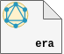

<p align="center">
  <br/>
  <a href="https://graphdoc-plugins.github.io"></a>
</p>

<h1 align="center">GraphQL schema HTML documentation generation, erasing unwanted types using graphdoc</h1>

[](https://graphdoc-plugins.github.io)
[](https://www.npmjs.com/package/graphdoc-plugin-erase)
[](https://www.npmjs.com/package/graphdoc-plugin-erase)
[](LICENSE.txt)
[](https://gmullerb.gitlab.io/graphdoc-plugin-erase/tests/tests_report.html)
[](https://gmullerb.gitlab.io/graphdoc-plugin-erase/coverage/index.html)
[](https://github.com/gmullerb/graphdoc-plugin-erase)
[](https://gitlab.com/gmullerb/graphdoc-plugin-erase)

__________________

## Quick Start

1 . Add dependencies:

`package.json`:

```json
  "devDependencies": {
    "@2fd/graphdoc": "2.4.0",
    "graphdoc-plugin-erase": "1.1.0",
```

2 . If default options are not suitable, then Configure `graphdoc-plugin-erase`:

`package.json`:

```json
{
  "graphdoc-plugin-erase": {
    "eraseByNameRegex": "\\w*No",
    "eraseByDescriptionRegex": "@RemoveFromDocumentation",
    "eraseByKindRegex": "(?:UNION|SCALAR)"
  }
}
```

3 Use `graphdoc-plugin-erase`:

`package.json`:

```json
  "scripts": {
    "doc": "graphdoc -p graphdoc/../../graphdoc-plugin-erase -p graphdoc/plugins/default -s ./schema.graphql -o ./build/documentation"
  }
```

or if using `graphdoc-plugin-flexible` instead of graphdoc default plugins

```json
  "scripts": {
    "doc": "graphdoc -p graphdoc/../../graphdoc-plugin-erase -p graphdoc/../../graphdoc-plugin-flexible -s ./schema.graphql -o ./build/documentation"
  }
```

> `graphdoc/../../` this is required to get external plugins working in `graphdoc`.

__________________

## Goals

`graphdoc-plugin-erase` provides a way to use [`graphdoc`](https://www.npmjs.com/package/@2fd/graphdoc) and remove some types that are not required in the documentation, e.g. `__Directive`, `__EnumValue`, `__DirectiveLocation`, etc.

## Options

`package.json`:

(*default values*)

```json
{
  "graphdoc-plugin-erase": {
    "eraseByNameRegex": "^__",
    "eraseByDescriptionRegex": "^$",
    "eraseByKindRegex": "^$"
  }
}
```

* `eraseByNameRegex`: Regular Expression to be used to remove types, based on `name`.
* `eraseByDescriptionRegex`: Regular Expression to be used to remove types, based on `description`.
* `eraseByKindRegex`: Regular Expression to be used to remove types, based on `kind`.

> `graphdoc-plugin-erase` plugin should be add before the plugins we want to have filtered types.

## Online Examples

* Pokemon GraphQL schema: [Project](https://github.com/gmullerb/base-graphdoc-yarn) and [Online generated documentation](https://gmullerb.gitlab.io/base-graphdoc-yarn).
* Github GraphQL schema: [Project](https://github.com/gmullerb/base-graphdoc-npm) and [Online generated documentation](https://gmullerb.gitlab.io/base-graphdoc-npm).

__________________

## Prerequisites

* [`"@2fd/graphdoc": "2.4.0"`](https://www.npmjs.com/package/@2fd/graphdoc/v/2.4.0).

> graphdoc can work with older versions of GraphQL (description syntax: #), and new versions (description syntax: """), [How to configure graphdoc](https://graphdoc-plugins.github.io/docs/how-to-configure-graphdoc.html).

__________________

## Documentation

* [Main documentation](https://graphdoc-plugins.github.io/docs/graphdoc-plugin-erase.html).

* [`CHANGELOG`](CHANGELOG.html): contains the information about changes in each version, chronologically ordered ([Keep a Changelog](http://keepachangelog.com)).

## Contributing

* **Use it**.
* **Share it**.
* [Give it a Star](https://github.com/gmullerb/graphdoc-plugin-erase).
* [Propose changes or improvements](https://github.com/gmullerb/graphdoc-plugin-erase/issues).
* [Report bugs](https://github.com/gmullerb/graphdoc-plugin-erase/issues).

## License

[MIT License](LICENSE.txt)

__________________

## Remember

* Use code style verification tools => Encourages Best Practices, Efficiency, Readability and Learnability.
* Code Review everything => Encourages Functional suitability, Performance Efficiency and Teamwork.
* If viable, Start testing early => Encourages Reliability and Maintainability.

## Additional words

Don't forget:

* **Love what you do**.
* **Learn everyday**.
* **Learn yourself**.
* **Share your knowledge**.
* **Think different!**.
* **Learn from the past, dream on the future, live and enjoy the present to the max!**.
* **Enjoy and Value the Quest** (It's where you learn and grow).

At life:

* Let's act, not complain.
* Be flexible.

At work:

* Let's give solutions, not questions.
* Aim to simplicity not intellectualism.
